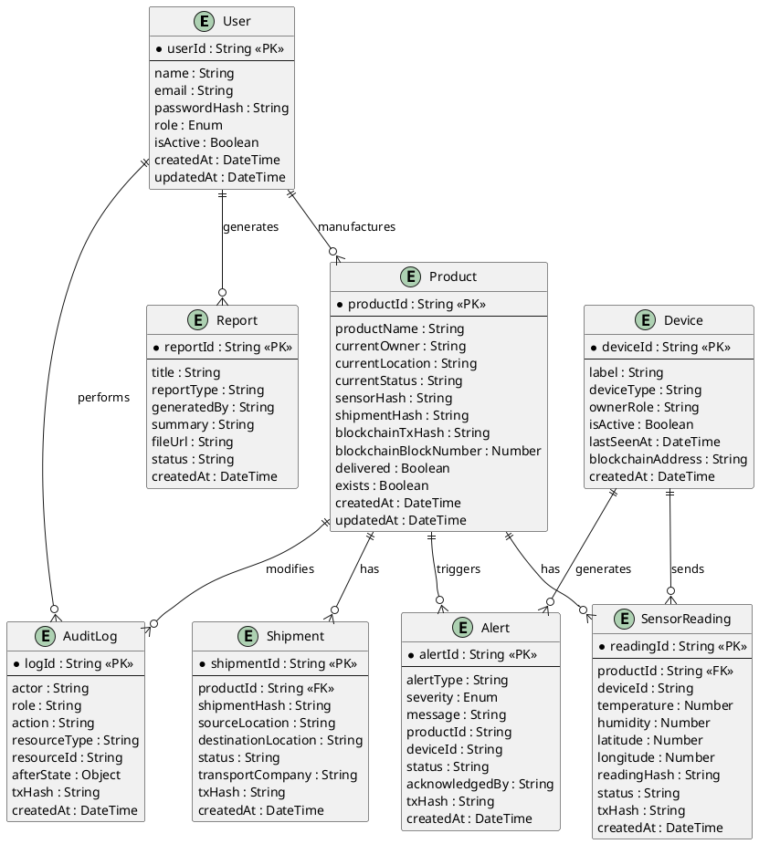

# Entity Relationship Diagram

## Database Schema

### Users Collection
| Field | Type | Description |
|-------|------|-------------|
| userId | String (PK) | Unique user identifier |
| name | String | Full name |
| email | String | Email address (unique) |
| passwordHash | String | Bcrypt hashed password |
| role | Enum | Administrator, Manufacturer, Distributor, Transport, Warehouse, Retailer, Consumer, Auditor |
| isActive | Boolean | Account status |
| createdAt | DateTime | Account creation time |
| updatedAt | DateTime | Last update time |

### Products Collection
| Field | Type | Description |
|-------|------|-------------|
| productId | String (PK) | Unique product identifier |
| productName | String | Product name |
| currentOwner | String | Current owner address |
| currentLocation | String | Current location |
| currentStatus | String | Current status |
| sensorHash | String | Hash of sensor data |
| shipmentHash | String | Hash of shipment data |
| blockchainTxHash | String | On-chain transaction hash |
| blockchainBlockNumber | Number | Block number |
| delivered | Boolean | Delivery status |
| exists | Boolean | Product existence |
| createdAt | DateTime | Creation time |
| updatedAt | DateTime | Last update time |

### Shipments Collection
| Field | Type | Description |
|-------|------|-------------|
| shipmentId | String (PK) | Unique shipment identifier |
| productId | String (FK) | Reference to Product |
| shipmentHash | String | Cryptographic hash |
| sourceLocation | String | Origin location |
| destinationLocation | String | Destination location |
| status | String | Shipment status |
| transportCompany | String | Carrier name |
| txHash | String | Transaction hash |
| createdAt | DateTime | Creation time |

### SensorReadings Collection
| Field | Type | Description |
|-------|------|-------------|
| readingId | String (PK) | Unique reading identifier |
| productId | String (FK) | Reference to Product |
| deviceId | String | IoT device identifier |
| temperature | Number | Temperature reading |
| humidity | Number | Humidity reading |
| latitude | Number | GPS latitude |
| longitude | Number | GPS longitude |
| readingHash | String | SHA256 hash of reading |
| status | String | Reading status |
| txHash | String | Transaction hash |
| createdAt | DateTime | Reading timestamp |

### Alerts Collection
| Field | Type | Description |
|-------|------|-------------|
| alertId | String (PK) | Unique alert identifier |
| alertType | String | Type: temperature, humidity, shipment-delay |
| severity | Enum | low, medium, high, critical |
| message | String | Alert message |
| productId | String | Associated product |
| deviceId | String | Associated device |
| status | String | open, acknowledged, resolved |
| acknowledgedBy | String | User who acknowledged |
| txHash | String | Transaction hash |
| createdAt | DateTime | Alert creation time |

### Devices Collection
| Field | Type | Description |
|-------|------|-------------|
| deviceId | String (PK) | Unique device identifier |
| label | String | Device name |
| deviceType | String | sensor, tracker, etc. |
| ownerRole | String | Owning role |
| isActive | Boolean | Device status |
| lastSeenAt | DateTime | Last communication |
| blockchainAddress | String | On-chain address |
| createdAt | DateTime | Registration time |

### Reports Collection
| Field | Type | Description |
|-------|------|-------------|
| reportId | String (PK) | Unique report identifier |
| title | String | Report title |
| reportType | String | summary, detailed, audit |
| generatedBy | String | Generator user |
| summary | String | Report summary |
| fileUrl | String | Storage location |
| status | String | generated, pending, failed |
| createdAt | DateTime | Generation time |

### AuditLogs Collection
| Field | Type | Description |
|-------|------|-------------|
| logId | String (PK) | Unique log identifier |
| actor | String | User who performed action |
| role | String | Actor's role |
| action | String | Action performed |
| resourceType | String | Type of resource |
| resourceId | String | Resource identifier |
| afterState | Object | State after action |
| txHash | String | Transaction hash |
| createdAt | DateTime | Action timestamp |