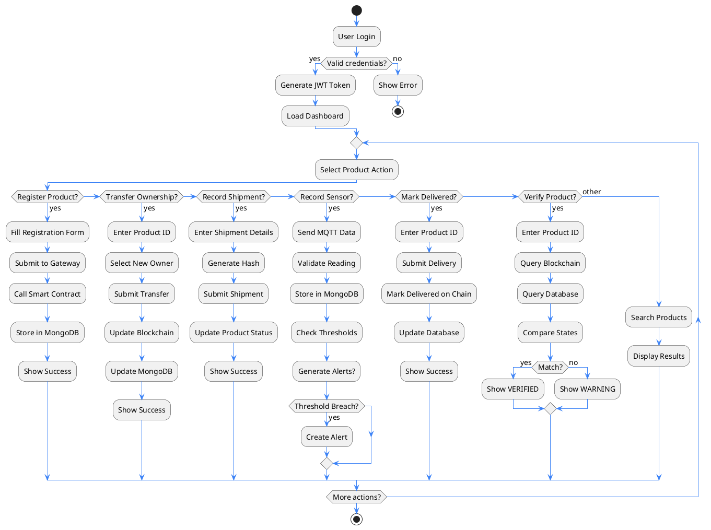
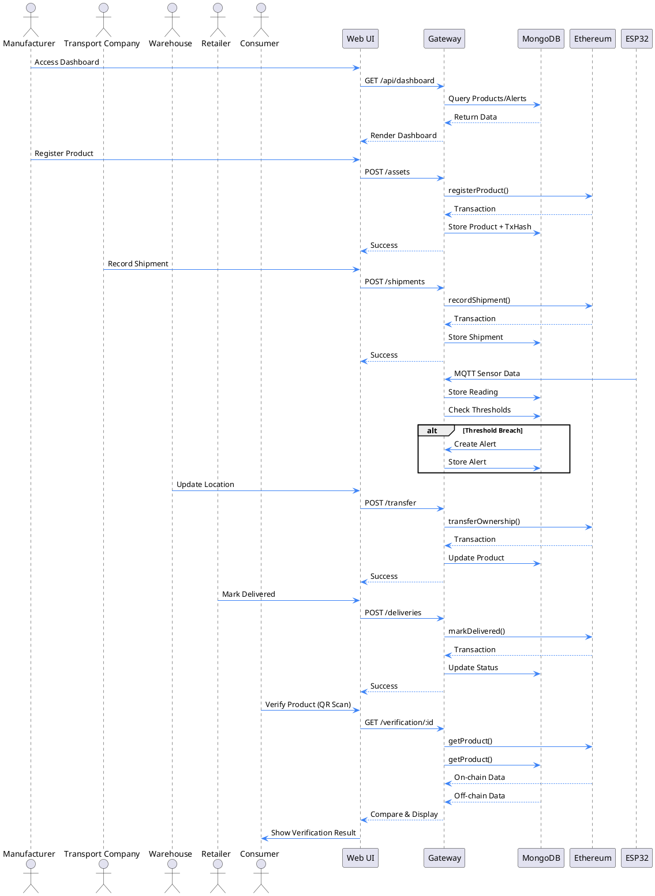

# Supply Chain Workflow Flowchart



## Workflow Sequence Diagram



## Process Flow

### 1. Product Registration Flow
```
Manufacturer → Web UI → Gateway → Smart Contract → Blockchain
                     ↓
                 MongoDB (Product + TxHash)
```

### 2. Sensor Data Ingestion Flow
```
ESP32 → MQTT Broker → Gateway → MongoDB
                              ↓
                     Check Thresholds → Alert (if needed)
```

### 3. Ownership Transfer Flow
```
User → Web UI → Gateway → Smart Contract → Blockchain
                     ↓
                 MongoDB (Update + Audit Log)
```

### 4. Verification Flow
```
Consumer → QR Scan → Web UI → Gateway
                            ↓
                     Compare: Blockchain vs MongoDB
                            ↓
                     Show: VERIFIED or WARNING
```

### 5. Alert Generation Flow
```
Sensor Reading → Threshold Check
              ↓
         Alert Conditions Met?
              ↓
         YES → Create Alert → Dashboard Notification
              ↓
         NO → Continue Monitoring
```