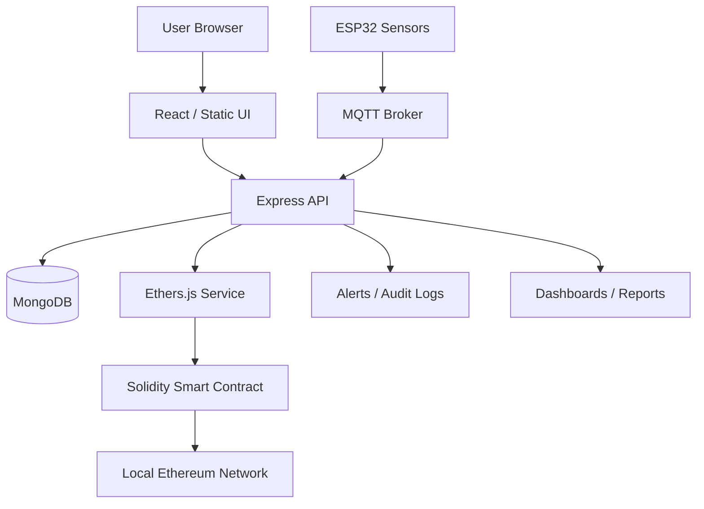

# Ethereum IoT Architecture

## Roles
- Administrators manage permissions and device registration.
- Manufacturers register products.
- Logistics actors record shipment and sensor hashes.
- Retailers mark delivery and close the chain of custody.
- Consumers verify product provenance.
- Auditors inspect immutable history and integrity.

## On-Chain Data
- Product ID
- Ownership changes
- Current status
- Sensor hash
- Shipment hash
- Event timestamps
- Transaction history

## Off-Chain Data
- Full IoT payloads
- Alerts and notifications
- Reports and analytics
- Session data and audit logs
- Search indexes and dashboard caches
