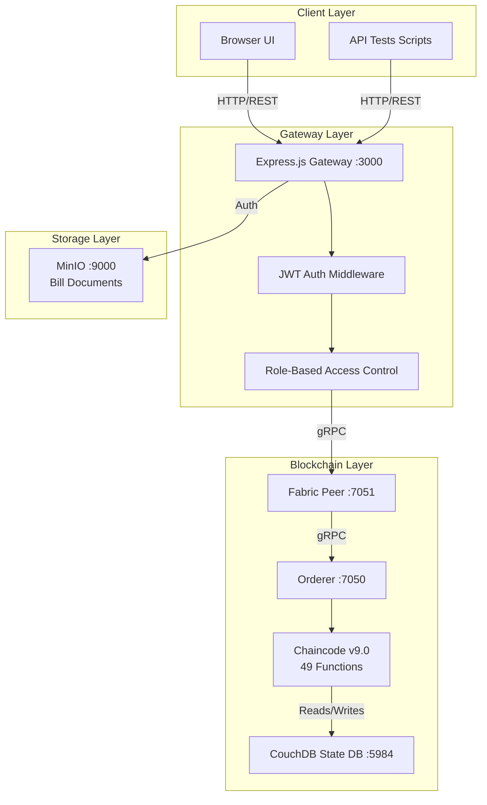

# Architecture

## Components

| Component | Technology | Purpose |
|-----------|-----------|---------|
| Browser UI | HTML, CSS, JavaScript | User interface for all proforma forms |
| API Gateway | Node.js, Express.js | REST API with JWT auth |
| Auth | JWT, bcryptjs | Authentication + RBAC middleware |
| Chaincode | Node.js (fabric-contract-api) | Smart contract on Fabric |
| Ledger | Fabric Ledger | Immutable transaction log |
| State DB | CouchDB | Rich query support for assets |
| File Storage | MinIO | Bill document storage |

## Data Flow

1. User authenticates → Gateway issues JWT token
2. API request includes JWT → RBAC middleware validates role
3. Authorized request → Gateway calls Fabric chaincode via SDK
4. Chaincode validates → Transaction committed to Fabric ledger
5. CouchDB state updated → Gateway returns response to client
6. Bill uploads → Stored in MinIO → SHA-256 hash on ledger

## Key Design Principles

- **Immutable state changes** via Fabric chaincode (no direct DB writes)
- **Role-based access** enforced at both API gateway and chaincode level
- **Lifecycle validation** in chaincode (PURCHASED → ACTIVE → ... → DISPOSED)
- **Bill verification** via SHA-256 hash comparison on ledger
- **Proforma linking** — IDs connect all four verification forms
