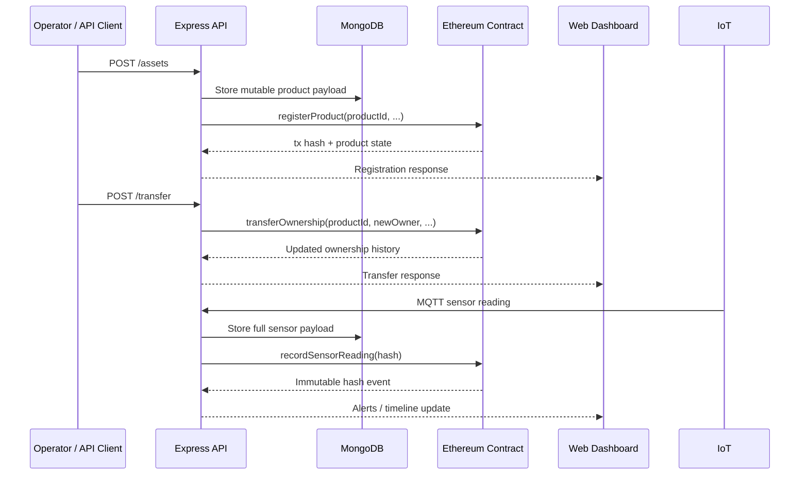

# Product Traceability Sequence

```mermaid
sequenceDiagram
    participant Operator as Operator / API Client
    participant API as Express API
    participant DB as MongoDB
    participant ETH as Ethereum Contract
    participant UI as Web Dashboard

    Operator->>API: POST /assets
    API->>DB: Store mutable product payload
    API->>ETH: registerProduct(productId, ...)
    ETH-->>API: tx hash + product state
    API-->>UI: Registration response
    Operator->>API: POST /transfer
    API->>ETH: transferOwnership(productId, newOwner, ...)
    ETH-->>API: Updated ownership history
    API-->>UI: Transfer response
    IoT->>API: MQTT sensor reading
    API->>DB: Store full sensor payload
    API->>ETH: recordSensorReading(hash)
    ETH-->>API: Immutable hash event
    API-->>UI: Alerts / timeline update
```
